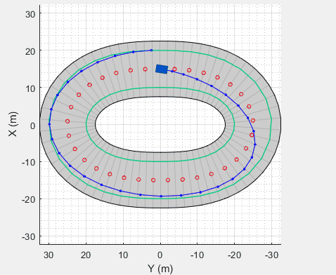
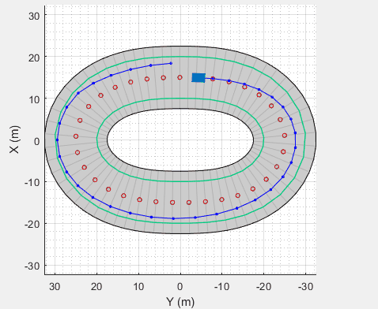
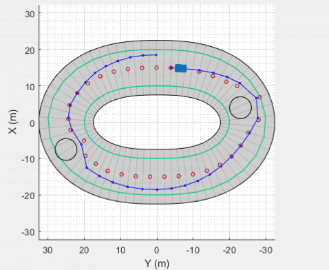

# ITOproject.github.io
Welcome to the MPC-Based Path Planning and Following project for ELEN90026 Introduction to Optimisation.

## Project Description
This project focuses on developing an MPC (Model Predictive Control) based path planning and following system for autonomous vehicles. The objective is to enable autonomous vehicles to plan their path, avoid obstacles, and accurately follow the planned path. The project emphasizes optimization techniques and introduces students to the practical application of optimization algorithms in autonomous vehicle control.

## Project Contributors
This project was developed by Lei Qin under the guidance of Ye Pu.

## GIFs and Visualizations
# Task2 Follow the centre path

# Task3 Follow the centre path and avoid cross the boundary

# Task5 Plan the path considering obstacles and follow the new path

## Acknowledgments
We would like to express our gratitude to the University of Melbourne's Department of Electrical and Electronic Engineering for providing the necessary resources and guidance for this project.

Enjoy exploring the exciting world of MPC-based path planning and following for autonomous vehicles!
